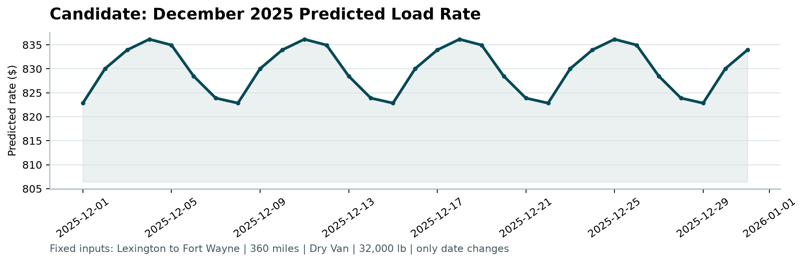

# Freight Rate Prediction Challenge

* A machine learning model to predict the Freight rate based on unhandled data.
* A data cleaning and analysis were made with previous assumptions to handle the predictions.
* Data where given in `./data` directory.

## What to do

1. Train and validate your model using `data/train_test.csv`.
2. Predict every load in `data/validation.csv`. Each load has a unique `load_id`.
3. Fill the matching `predicted_rate` values in `data/validation_predictions_template.csv` and save it as `validation_predictions.csv`.
4. Predict every row in `data/december_chart_inputs.csv` by filling its `predicted_rate` column.
5. Install the scorer requirements and run:

```bash
python -m pip install -r requirements.txt
python score.py --predictions validation_predictions.csv --december-predictions data/december_chart_inputs.csv
```


## Training result 

